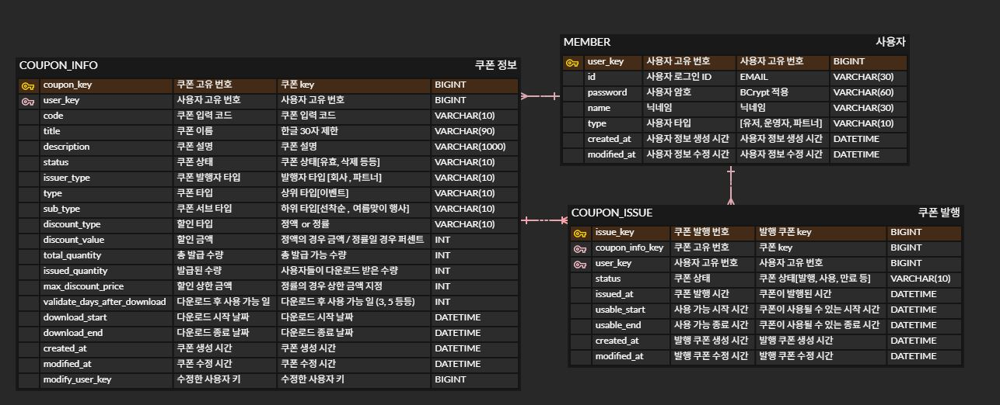

# race-to-coupon
쿠폰 발급 시스템

### 기획 의도
정부가 주최하는 국내 숙박 할인 이벤트인 숙박세일페스타는, 사용자들이 쿠폰을 발급받기 위해 단시간에 대량의 요청을 보내는 구조입니다. 평소에는 쿠폰 발급 서버가 안정적으로 운영되지만, 이 이벤트 기간 동안에는 스파이크 트래픽으로 인해 서버가 에러 응답을 자주 반환하는 문제가 발생했습니다.

문제를 분석해본 결과, API 요청을 처리하는 과정에서 네임드 락(Named lock)이 해제되지 않는 일이 잦아지며 쿠폰 발급 속도가 느려지고 전체 응답 실패율도 높아졌다는 사실을 확인할 수 있었습니다. 네임드 락이 API 단위로 락을 점유하는 구조라, 동시에 많은 사용자가 몰리면 병목이 발생할 수밖에 없었습니다.

> 이러한 경험을 바탕으로, **쿠폰 발급을 보다 빠르고 안정적으로 처리할 수 있는 서버 아키텍처는 무엇일까?** 라는 고민에서 이 프로젝트를 시작하게 되었습니다.

### 목표
- 쿠폰 발급, 쿠폰 조회, 쿠폰 설정 등 핵심 기능을 단계적으로 구현합니다.
- 쿠폰 발급 시 발생할 수 있는 병목 상황(선착순, 중복 발급 등) 에 대응하기 위해 다양한 동시성 방식을 사용해봅니다.
    - 예: Synchronized, DB Lock (Optimistic/Pessimistic), Redis 분산락, 메시지 큐 기반 처리 등

### 요구 사항
- 운영자
    - 쿠폰 관리
        - 쿠폰을 생성할 수 있다.
            - 쿠폰 코드는 자동 또는 수동으로 생성된다.(알파벳 대문자 및 숫자를 포함한 10자)
                - 쿠폰 코드 미입력시 자동 생성, 입력시 수동 생성
        - 쿠폰을 수정할 수 있다.
            - 쿠폰의 이름, 설명, 다운로드 시작, 종료일자, 상태만 변경 가능하다.
            - 할인 타입이나 할인 금액등은 변경할 수 없다.
                - 변경하면 이미 발급 받은 사람들의 쿠폰도 변경된다.
                - 새로운 할인 타입이나 할인금액을 설정하고 싶다면, 새 쿠폰을 생성해야 한다.
        - 쿠폰을 삭제할 수 있다.
            - 삭제 상태로 변경한다.
    - 쿠폰 조회
        - 쿠폰의 상세 정보를 볼 수 있다.
        - 쿠폰의 리스트를 볼 수 있다.
            - 기본 정렬은 쿠폰 고유 번호 내림차순이다.
    - 인증
        - 관리자는 로그인을 할 수 있다.
        - 관리자는 로그아웃 할 수 있다.
- 유저
    - 쿠폰
        - 쿠폰 발급 요청(버튼 클릭 등)을 하여 쿠폰을 한 번 발급 받을 수 있다.
        - 쿠폰 코드를 입력하여 쿠폰을 한 번 발급 받을 수 있다.
        - 쿠폰을 사용할 수 있다.
        - 내 쿠폰 리스트를 볼 수 있다.
            - 기본 정렬은 쿠폰 발행 번호 내림차순이다.
    - 인증
        - 사용자는 로그인을 할 수 있다.
        - 사용자는 로그아웃 할 수 있다.

### DB 스키마
ERD 주소
- [ERD 링크](https://www.erdcloud.com/d/6Kdd26YsXbGCna4oA)
  
- 쿠폰 테이블
    - 정규화된 형태로 설계 (발급 처리 효율성, 무결성 확보에 중점)
    - 추후 조회 트래픽 증가에 따라 반정규화 고려 예정
- 유저 테이블
    - 유저와 운영자(+파트너)를 단일 테이블로 통합 관리
        - 추후에 별도의 분리된 테이블이 필요할 수 있으나, 현재는 통합해서 관리한다.

### API
운영자 (Admin) API

메서드	| URI	| 설명 |
-------|-------|------|
POST | /admin/login | 로그인 |
POST | /admin/logout | 로그아웃 | 
POST   | /admin/coupons	| 쿠폰 생성 (등록) |
PATCH    | /admin/coupons | 쿠폰 수정 |
PATCH	| /admin/coupons/{couponId}	| 쿠폰 삭제(삭제 상태로 변경) |
GET | /admin/coupons | 쿠폰 리스트 조회 |
GET | /admin/coupons/{couponId} | 쿠폰 상세 조회 |

사용자 (Member) API

메서드	| URI | 설명|
-------|-----|----|
POST | /user/sign-up | 회원가입 |
POST | /user/login | 로그인 |
POST | /user/logout | 로그아웃 |
POST | /user/coupons | 쿠폰 발급 요청(선착순) |
POST | /user/coupons/codes | 쿠폰 발급(코드 입력) |
POST | /user/coupons/use | 쿠폰 사용 |
GET  | /user/coupons | 쿠폰 리스트 조회(내 쿠폰) |